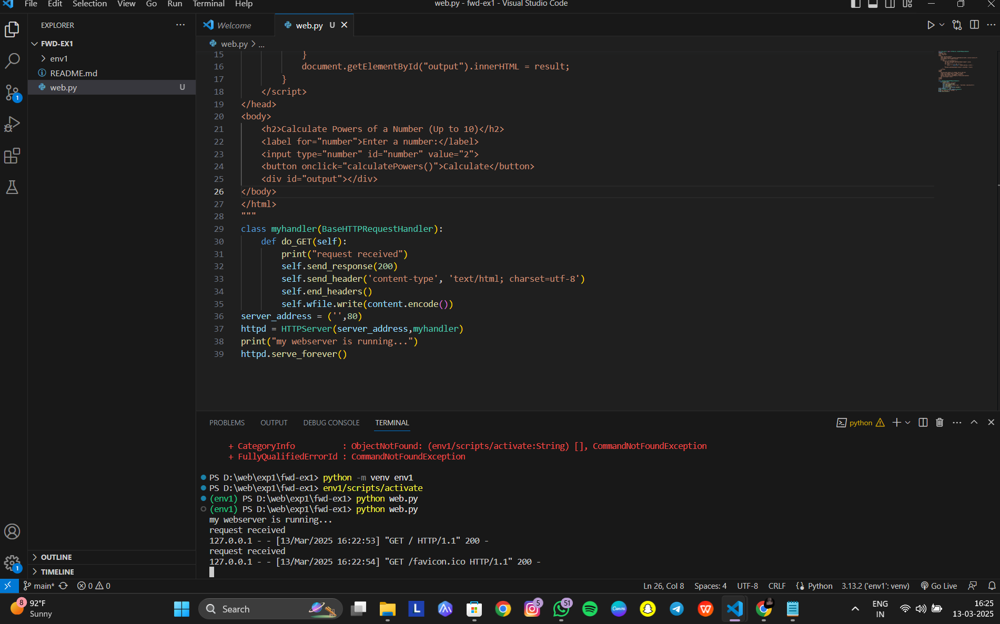
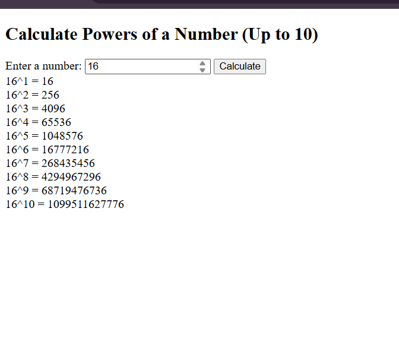

# EX01 Developing a Simple Webserver
## Date: 20.03.2025
### Name : Thamizh.S
### Reg number : 212224040350
## AIM:
To develop a simple webserver to serve html pages and display multipication table

## DESIGN STEPS:

### Step 1: 
HTML content creation.

### Step 2:
Design of webserver workflow.

### Step 3:
Implementation using Python code.

### Step 4:
Import the necessary modules.

### Step 5:
Define a custom request handler.

### Step 6:
Start an HTTP server on a specific port.

### Step 7:
Run the Python script to serve web pages.

### Step 8:
Serve the HTML pages.

### Step 9:
Start the server script and check for errors.

### Step 10:
Open a browser and navigate to http://127.0.0.1:8000 (or the assigned port).

## PROGRAM:
from http.server import HTTPServer, BaseHTTPRequestHandler
content = """
<!DOCTYPE html>
<html lang="en">
<head>
    <meta charset="UTF-8">
    <meta name="viewport" content="width=device-width, initial-scale=1.0">
    <title>Powers of a Number</title>
    
</head>
<body>
    <h2>Calculate Powers of a Number (Up to 10)</h2>
    <label for="number">Enter a number:</label>
    <input type="number" id="number" value="2">
    <button onclick="calculatePowers()">Calculate</button>
    

</body>
</html>
"""
class myhandler(BaseHTTPRequestHandler):
    def do_GET(self):
        print("request received")
        self.send_response(200)
        self.send_header('content-type', 'text/html; charset=utf-8')
        self.end_headers()
        self.wfile.write(content.encode())
server_address = ('',80)
httpd = HTTPServer(server_address,myhandler)
print("my webserver is running...")
httpd.serve_forever()

## OUTPUT:

## RESULT:
The program for implementing simple webserver is executed successfully.

